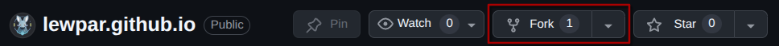
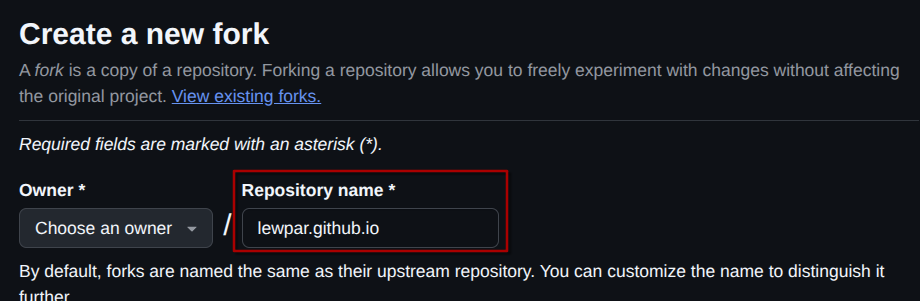

# Portfolio Starter Template
This repository acts as both my personal portfolio and a starter template for anybody who is interested in creating their own portfolio.
To use this template follow the `Get Started` section below.

## Get Started

### Forking the Repository
1. Click the `Fork` button at the top of the repository.

2. Rename the Repository name to your GitHub name followed by `github.io`. For example if your GitHub name is `lewpar` your repository name should be `lewpar.github.io`.

3. Clone the repository onto your system, replacing `YOUR-USERNAME` with your GitHub username:
```
git clone https://github.com/YOUR-USERNAME/YOUR-USERNAME.github.io
```

### Personalization
Obviously the portfolio template is only useful to me when it has my face, qualifications, and projects plastered on it so you need to customize it.

The main way to customize the portfolio is to access the `app/data` folder which contains `JavaScript Object Notation (JSON)` files that are used to store the awards, education, experience, profile, and project data.
It also contains the data for the commit heatmap (`commits.json`), this file should not be edited as it is auto-populated by a GitHub action/workflow.

Start by editing the following files:
- `awards.json`
- `education.json`
- `experience.json`
- `profile.json`
- `projects.json`

The other area of interest is the `public` folder. This folder contains the static image assets for the landing page and projects pages.

## Running Locally
This template is created using the metaframework `Nuxt`, to run the project after cloning it to your system you must:
1. Install the required dependencies:
```
npm install
```
2. Run the project
```
npm run dev
```